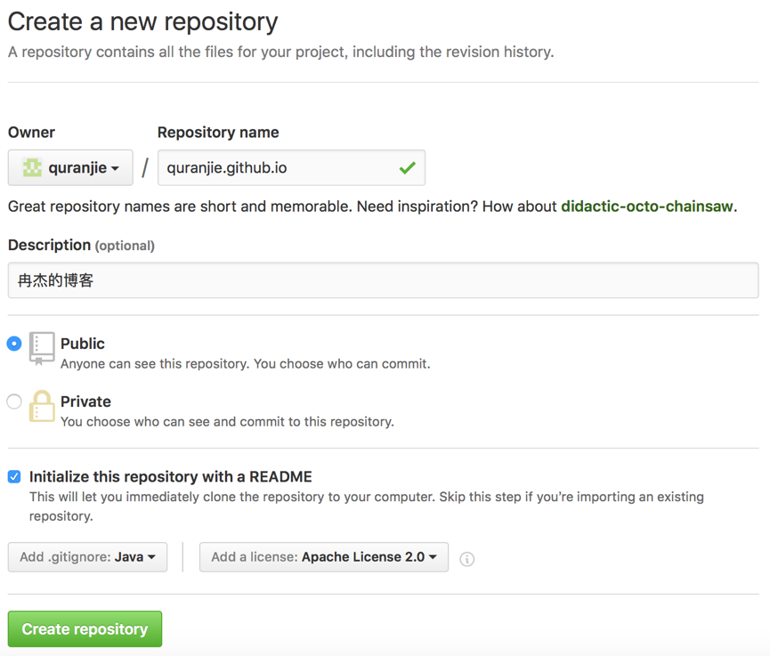

<span class="post-date">1 Jan 2017</span>
<p class="message">
  这是我的第一篇博客，想写的有很多。就从我如何搭建博客开始吧！我是使用Jekyll搭建的，Jekyll是一个简单的免费Blog生成工具，类似WordPress。但是他们又有很大的不同，原因是Jekyll知识一个生成静态网页的工具，不需要数据库支持。目前也有很多人使用Hexo搭建博客，感觉两种方式都很不错。
</p>

在github上搭建博客，首先要有自己的账号，不多说。

1、首先创建页面仓库，这个仓库的名字需要和你的账号对应，如quranjie.github.io，输入基本信息然后点击创建仓库。


2、去[Jekyll官网](http://jekyllthemes.org)下载一个合适的主题，拷贝到项目根目录，提交到github上，在浏览器上输入https://quranjie.github.io就可以看到效果啦。

3、如果想要在本地看效果和调试，就需要使用[Bundler](https://github.com/bundler/bundler)了，安装Bundler的步骤如下：

* 先检查ruby的版本，要求ruby版本高于2.1.0。在控制台执行命令  
  ```ruby --version```
* 安装Bundler  
  ```gem install bundler```
* 然后进入项目根目录，需要有一个Gemfile的文件，没有则创建。里面的内容为：  

```
  source ‘https://rubygems.org’  
  gem ‘github-pages’, group::jekyll_plugins
```
* 然后执行  
```bundle install```
* 现在就可以在本地运行jekyll站点了  
```bundle exec Jekyll serve```  

可以看到运行成功提示，服务器地址```http://127.0.0.1:4000/```

本文的[参考网址](https://help.github.com/articles/using-jekyll-as-a-static-site-generator-with-github-pages/
)

<p class="next-post">下一篇我将详细的讲讲github命令</p>
